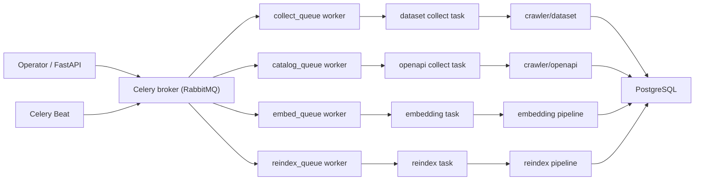
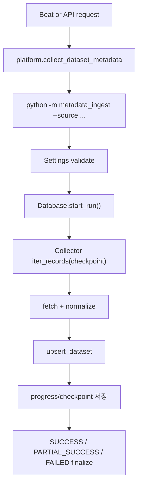
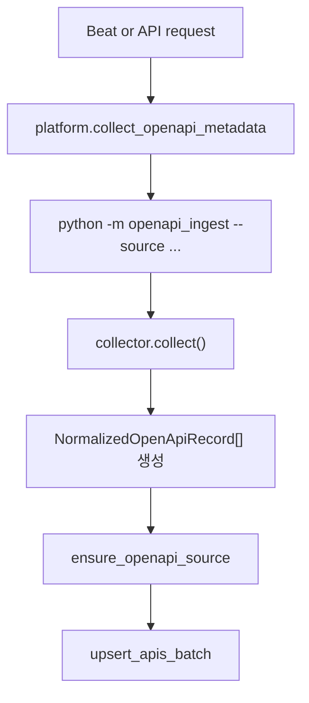
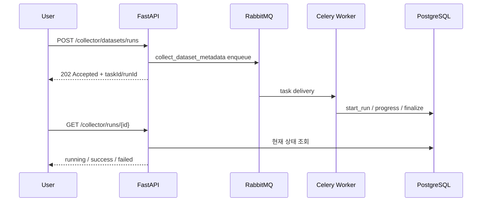

# SODA 데이터 플랫폼 Celery 배치 전환 설계

## 1. 목표

`data-platform`의 Python 수집 코드를 **Celery 기반 배치 시스템**으로 정리한다.

이번 설계의 목표는 다음과 같다.

- dataset 메타데이터 수집을 운영 가능한 배치 작업으로 전환한다.
- openapi 수집기를 **실수집기**와 **카탈로그 생성기**로 구분해 운영 정책을 명확히 한다.
- FastAPI 수동 실행 경로와 Celery 실행 경로를 일원화한다.
- `worker / beat / queue / retry / checkpoint / alert` 기준을 정한다.

## 2. 현재 상태 요약

현재 구조의 핵심 파일:

- [celery_app.py](C:\Users\SSAFY\Desktop\soda\data-platform\api\app\core\celery_app.py)
- [platform_tasks.py](C:\Users\SSAFY\Desktop\soda\data-platform\api\app\tasks\platform_tasks.py)
- [collector.py](C:\Users\SSAFY\Desktop\soda\data-platform\api\app\api\v1\endpoints\collector.py)
- [collector_service.py](C:\Users\SSAFY\Desktop\soda\data-platform\api\app\services\collector_service.py)
- [docker-compose.worker.prod.yml](C:\Users\SSAFY\Desktop\soda\data-platform\docker-compose.worker.prod.yml)

현재 확인된 상태:

- Celery task는 이미 존재한다.
- Celery beat는 존재하지만 `platform.ping`만 스케줄링한다.
- FastAPI의 `/collector/datasets/runs`는 아직 Celery를 쓰지 않고 thread 기반이다.
- dataset 수집기는 대부분 실제 수집기로 동작한다.
- openapi 수집기는 `datagokr`를 제외하면 대부분 정적/반정적 카탈로그 생성기다.
- `generate_embeddings`, `reindex_metadata`는 placeholder다.

## 3. 현재 구조의 문제

### 3.1 실행 경로 이원화

- 수동 API 실행은 `collector_service -> thread -> subprocess`
- 배치 실행은 `Celery worker -> platform_tasks -> subprocess`

즉 같은 일을 두 경로로 실행한다.

### 3.2 스케줄링 부재

- beat가 heartbeat만 보내고 실제 수집 작업은 예약하지 않는다.

### 3.3 운영 정책 부재

- 어떤 소스를 주기 배치에 태울지 기준이 없다.
- dataset과 openapi의 운영 성격이 다른데 동일한 task 수준에서만 다뤄진다.

### 3.4 openapi 수집기 성격 혼재

- `datagokr`는 실수집기
- `crypto_exchange`, `game`, `kakao`, `kis`, `kobis`, `naver_map`, `odsay`, `tmap`, `tosspayments`는 대부분 문서 기반 카탈로그 생성기

## 4. 대안 검토

### 대안 A. 현재 thread 방식 유지

장점:
- 변경량이 가장 작다.

단점:
- 재시도, queue 분리, 주기 실행, worker 분산, 운영 관찰성이 약하다.
- API 경로와 배치 경로가 계속 따로 논다.

### 대안 B. Celery를 수동/배치 공통 실행 엔진으로 사용

장점:
- 수동 실행과 주기 실행을 같은 실행 모델로 통일할 수 있다.
- queue, retry, beat, worker scale-out 적용이 쉽다.
- 현재 인프라와 잘 맞는다.

단점:
- API 엔드포인트와 status 추적 구조를 바꿔야 한다.

### 대안 C. 외부 scheduler + 독립 cron 컨테이너 도입

장점:
- Celery beat 의존도를 줄일 수 있다.

단점:
- 이미 worker/beat가 있는 현재 구조와 중복된다.
- 운영 복잡도만 늘어난다.

### 권고안

**대안 B**를 채택한다.

이유:

- 이미 Celery worker/beat 컨테이너가 존재한다.
- 수동 실행과 배치 실행을 한 모델로 통일할 수 있다.
- dataset 수집기의 checkpoint/run 관리 구조를 가장 자연스럽게 살릴 수 있다.

## 5. 목표 토폴로지

## 6. 핵심 설계 결정

### 6.1 FastAPI는 Celery dispatch만 담당

- 수집 API는 더 이상 직접 thread/subprocess를 실행하지 않는다.
- 요청 검증 후 Celery task를 enqueue 하고 task id / run id를 반환한다.

### 6.2 dataset 수집 정책을 세 부류로 나눈다

#### A. 표준 자동수집 대상

- `data_europa`
- `figshare`
- `zenodo`
- `harvard_dataverse`
- `data_gov`
- `aws_odr`
- `huggingface`

특징:

- 공식 API/SDK 중심
- 구조가 비교적 안정적
- 실패 원인이 네트워크/API 응답으로 수렴하는 편

#### B. 고위험 자동수집 대상

- `kaggle`
- `aihub`
- `public_data_portal`

특징:

- `kaggle`: 인증 상태와 계정/API key에 의존
- `aihub`: HTML/DOM selector 의존이 큼
- `public_data_portal`: HTML 파싱 + locale variant + fallback 흐름이 복잡함

운영 원칙:

- 자동수집에는 포함한다.
- 다만 주기를 낮추고, 안전 모드와 격리된 실패 정책을 강제한다.
- 연속 실패 시 경고만이 아니라 `quarantine 후보`로 표시한다.

#### C. openapi 카탈로그 refresh 대상

- `datagokr`
- `crypto_exchange`
- `game`
- `kakao`
- `kis`
- `kobis`
- `naver_map`
- `odsay`
- `tmap`
- `tosspayments`

즉 1차는 dataset 자동수집을 우선 구축하고, openapi는 기존 분류를 유지한다.

## 7. 큐 설계

| 큐 | 용도 | 대상 |
| --- | --- | --- |
| `collect_queue` | dataset 실수집 | dataset 메타데이터 수집 |
| `catalog_queue` | openapi 카탈로그/저빈도 갱신 | openapi 메타데이터 수집 |
| `embed_queue` | 임베딩 생성 | 후속 pipeline |
| `reindex_queue` | 검색 인덱스 재생성 | 후속 pipeline |

권장 변경:

- `platform.collect_openapi_metadata`를 `catalog_queue`로 분리
- `collect_queue`와 `catalog_queue` worker를 논리적으로 분리

## 8. Dataset 배치 flow

운영 원칙:

- source 단위 실행을 기본으로 한다.
- `all`은 운영 beat 기본에서 금지하고, maintenance 용도로만 둔다.
- 실패한 source만 재실행 가능하도록 API/운영 절차를 만든다.
- beat 실행은 항상 `safe=true`를 기본으로 한다.

## 9. OpenAPI 배치 flow

운영 원칙:

- `datagokr`는 정기 실행 가능
- 나머지는 저빈도 refresh 또는 수동 seed

## 10. API 설계 변경 방향

현재:

- `/collector/datasets/runs` 만 존재
- dataset만 시작 가능
- Celery 미사용

목표:

- `/collector/datasets/runs`
  - Celery task enqueue
  - `taskId`, `source`, `queuedAt` 반환
- `/collector/openapis/runs`
  - 동일 구조
- `/collector/runs/{id}`
  - 현재 상태 조회

현재 구현 반영:

- dataset 수동 실행 endpoint는 이미 Celery enqueue로 전환됨
- 응답은 `202 Accepted` + `taskId` 중심으로 반환
- 실패 시 broker/dispatch 예외를 `500`으로 반환

예상 flow:

## 11. Dataset 스케줄 정책

### 11.1 4시간 간격 기본 원칙

dataset 자동수집 1차에서는 **모든 dataset source를 4시간 간격**으로 실행한다.

다만, 모든 source를 같은 시각에 동시에 실행하지 않는다.

이유:

- 외부 API/account quota 집중 소모를 피해야 한다.
- worker 부하를 분산해야 한다.
- source별 실패 분석을 더 쉽게 해야 한다.

따라서 `4시간 간격`은 유지하되, **source별 offset**을 둔다.

### 11.2 4시간 간격 + offset 스케줄

| source | 실행 간격 | 권장 offset | safe mode | 비고 |
| --- | --- | --- | --- | --- |
| `huggingface` | 4시간 | +00분 | 강제 | SDK 기반, rate limit 문서 공개 |
| `data_europa` | 4시간 | +20분 | 강제 | read-only API, 공개 rate limit 수치 없음 |
| `figshare` | 4시간 | +40분 | 강제 | 1 req/s 이하 권고 |
| `zenodo` | 4시간 | +60분 | 강제 | guest/auth rate limit 문서 공개 |
| `harvard_dataverse` | 4시간 | +80분 | 강제 | pagination 명시, 공개 rate limit 수치 없음 |
| `data_gov` | 4시간 | +100분 | 강제 | 기본 1000 req/hour per key |
| `aws_odr` | 4시간 | +120분 | 강제 | registry metadata, S3/NDJSON 기반 |
| `kaggle` | 4시간 | +140분 | 강제 | 인증 의존, 공식 공개 rate limit 수치 불명확 |
| `aihub` | 4시간 | +160분 | 강제 | DOM/HTML 크롤링 |
| `public_data_portal` | 4시간 | +180분 | 강제 | HTML + fallback 로직 |

운영 메모:

- 4시간 주기는 같지만, 실제 시작 시각을 20분 간격으로 분산한다.
- 동일 source가 이전 run을 끝내지 못한 경우 다음 스케줄은 skip 한다.
- `FAILED` 이어도 다른 source 스케줄에는 영향 주지 않는다.
- `all` task는 beat에 등록하지 않는다.

### 11.3 고위험 자동수집 소스 추가 제약

`kaggle`, `aihub`, `public_data_portal`에는 아래 정책을 추가한다.

- 동일 source 연속 2회 실패 시 경고 알림
- 동일 source 연속 3회 실패 시 `quarantine 후보`로 분류
- `kaggle` 인증 실패는 자동 재시도 금지
- `aihub`, `public_data_portal`는 0건 수집/급감 시 구조 변경 가능성 경고

## 12. 예외 처리 매트릭스

| 예외 유형 | 예시 | 처리 방식 | 재시도 | 알림 |
| --- | --- | --- | --- | --- |
| 레코드 단위 파싱 실패 | 특정 상세 페이지 파싱 오류 | 실패 count 증가 후 다음 레코드 진행 | 없음 | 실패율 높을 때 경고 |
| 일시적 네트워크 오류 | timeout, 429, 502, 503, 504 | 기존 retry 후 계속 진행 또는 source 실패 | 있음 | source 실패 시 즉시 |
| 인증/환경설정 오류 | Kaggle key 누락, API key 오류 | source 즉시 `FAILED` | 없음 | 즉시 |
| DB 오류 | connection reset, transaction 오류 | rollback 후 source `FAILED` | 다음 스케줄 run에서 resume | 즉시 |
| worker crash/interruption | worker 재시작, 서버 재부팅 | stale `RUNNING` 정리 후 다음 run resume | 다음 스케줄 run | 즉시 |
| 이상징후 | 수집 0건, 평소 대비 급감 | run은 성공 가능, anomaly warning 기록 | 없음 | 경고 |

## 13. 외부 호출 제한 조사 결과

공식 문서 기준으로 확인된 내용은 다음과 같다.

- Hugging Face
  - 5분 window 기준 rate limit이 공개돼 있다.
  - `huggingface_hub`는 429 발생 시 `RateLimit` 헤더를 읽어 smart retry를 수행한다.
  - 출처: [Hugging Face rate limits](https://huggingface.co/docs/hub/rate-limits)
- Zenodo
  - guest: 60 req/min, 2000 req/hour
  - authenticated: 100 req/min, 5000 req/hour
  - OAI-PMH harvesting: 120 req/min
  - 출처: [Zenodo developers](https://developers.zenodo.org/)
- api.data.gov
  - 기본 limit: 1000 req/hour per API key
  - 초과 시 429, 한시적 block
  - 출처: [api.data.gov developer manual](https://api.data.gov/docs/developer-manual/)
- Figshare
  - 자동 rate limiting 수치는 두지 않지만, 1 req/s 이하의 책임 있는 사용을 권고한다.
  - pagination/offset 한계도 있다.
  - 출처: [Figshare docs](https://docs.figshare.com/)
- data.europa
  - search/repo API는 공개돼 있으나, rate limit 수치는 명시적으로 공개된 문서를 찾지 못했다.
  - 출처: [data.europa API 안내](https://data.europa.eu/en/which-apis-are-available-and-where-can-i-find-information-about-them)
- Harvard Dataverse
  - search pagination은 문서화돼 있으나, 공개된 수치형 rate limit 문서는 찾지 못했다.
  - 출처: [Dataverse search API](https://guides.dataverse.org/en/latest/api/search.html)
- AWS ODR
  - registry metadata는 machine-readable registry/NDJSON 형태로 제공된다.
  - 일반적인 계정당 API quota보다는 metadata registry consume 패턴에 가깝다.
  - 출처: [Registry of Open Data on AWS](https://registry.opendata.aws/registry-open-data/)
- Kaggle
  - 공식 인증 절차는 문서화돼 있으나, 공개된 수치형 rate limit 문서는 확인하지 못했다.
  - 따라서 opaque external limit로 취급한다.
  - 출처: [Kaggle API](https://github.com/Kaggle/kaggle-api)

설계 원칙:

- 공개 limit가 있는 소스는 그 수치보다 훨씬 보수적으로 호출한다.
- 공개 limit가 없는 소스는 `opaque external limit`로 간주하고 safe mode + staggered schedule + exponential backoff를 적용한다.
- 4시간 간격 스케줄이라도 source별 offset과 overlap 방지가 없으면 집중 호출 문제가 생길 수 있으므로 반드시 함께 도입한다.

## 14. source overlap 방지

dataset 자동수집 1차에서 반드시 넣어야 할 보호는 `동일 source 동시 실행 방지`다.

현재 구조는 이전 `RUNNING` run을 `STOPPED`로 정리하고 새 run을 시작할 수 있으므로, beat와 manual trigger가 겹치면 run 상태가 꼬일 수 있다.

1차 설계:

- source별 advisory lock 또는 동등한 per-source lock 도입
- lock 획득 실패 시 새 run 시작 안 함
- 상태는 `SKIPPED` 또는 운영 로그에 명시
- beat와 manual trigger 모두 동일 규칙을 사용

현재 구현 반영:

- `pg_try_advisory_lock(namespace=105, source_id)` 방식으로 source lock을 획득
- lock 실패 시 `SourceRunAlreadyActiveError`를 발생시킴
- CLI summary는 overlap을 `failed`가 아니라 `skipped`로 기록

## 15. RabbitMQ 운영 원칙

RabbitMQ는 현재처럼 dev/prod를 분리해 유지한다.

- dev:
  - host: `rabbitmq`
  - vhost: `dev`
- prod:
  - host: `rabbitmq-prod`
  - vhost: `prod`

즉 broker를 하나로 합치지 않고, 현재 env 분리를 그대로 사용한다.

같은 queue 이름을 쓰더라도 vhost가 다르면 논리적으로 분리되므로, 1차에서는 queue naming보다 vhost 분리를 우선 보장한다.

## 16. 실패 처리와 재시도

### 16.1 dataset

- collector 내부 retry는 유지
- Celery level retry는 source/task 단위로 제한적으로 적용
- 재시도 횟수 초과 시 `FAILED`
- checkpoint가 있으므로 source 재실행 시 resume 가능

### 16.2 openapi

- `datagokr`는 batch 실패 시 batch 단위 오류 누적
- 카탈로그 생성기들은 전체 재실행 비용이 낮으므로 단순 재실행 허용

## 17. 스케줄 설계 초안

| 작업 | 주기 | 비고 |
| --- | --- | --- |
| dataset `data.europa` | 4시간 | source offset 적용 |
| dataset `figshare` | 4시간 | source offset 적용 |
| dataset `zenodo` | 4시간 | source offset 적용 |
| dataset `harvard_dataverse` | 4시간 | source offset 적용 |
| dataset `data_gov` | 4시간 | source offset 적용 |
| dataset `aws_odr` | 4시간 | source offset 적용 |
| dataset `huggingface` | 4시간 | source offset 적용 |
| dataset `kaggle` | 4시간 | 고위험 자동수집, source offset 적용 |
| dataset `aihub` | 4시간 | 고위험 자동수집, source offset 적용 |
| dataset `public_data_portal` | 4시간 | 고위험 자동수집, source offset 적용 |
| openapi `datagokr` | weekly | CSV 기반 |
| openapi catalog refresh | manual / monthly | 저빈도 |
| embedding | nightly | 실수집 후속 |
| reindex | nightly | 실수집 후속 |

dataset 1차 운영 원칙:

- 모든 dataset source는 4시간 간격으로 돈다.
- 모든 source는 동시에 시작하지 않고 offset을 둔다.
- beat 실행은 `safe=true`를 기본으로 한다.
- 발표 전 bootstrap 단계에서는 `DATASET_AUTO_COLLECTION_MAX_RUNTIME_SECONDS`를 사용해 count cap 대신 time budget 기준으로 최대한 수집한다.
- `all` source task는 beat에 등록하지 않는다.

현재 구현 반영:

- beat schedule은 `dataset-auto-collect-{source}` 이름으로 source별 entry를 생성
- 기본 source 목록은 dataset 전 source 10개다
- 기본 간격은 `DATASET_AUTO_COLLECTION_INTERVAL_HOURS=4`
- 기본 bounded limit는 `DATASET_AUTO_COLLECTION_LIMIT` 또는 `DEFAULT_SAFE_LIMIT`을 사용한다
- 단, `DATASET_AUTO_COLLECTION_MAX_RUNTIME_SECONDS`가 설정되면 정기 수집 task는 count limit를 비우고 time budget까지 실행한다
- 4시간 버킷 내부 분산은 source index 기반 minute/hour offset 계산으로 구현했다

## 18. 관찰성 / 운영 지표

필수 지표:

- task enqueue 수
- task success / failed 수
- source별 소요 시간
- source별 upsert 건수
- source별 failed 건수
- queue backlog
- last successful run timestamp

권장:

- Mattermost 알림
- 실패 source 목록 요약
- `FAILED` / `PARTIAL_SUCCESS` 구분 알림

## 19. 구현 단계

### 단계 1

- Celery route 분리
- `catalog_queue` 추가
- FastAPI 수집 API -> Celery dispatch 전환
- source overlap 방지 추가

### 단계 2

- dataset 전 source 배치 등록
- 4시간 간격 beat schedule + source offset 반영
- bounded incremental batch 정책 반영
- `datagokr` 배치 등록

### 단계 3

- run status 조회 API 추가
- task 결과/진행률 표준화
- 실패/경고 알림 추가

### 단계 4

- embedding / reindex 실제 구현
- 알림 / 운영 대시보드 보강

## 20. 성공 기준

- 수동 API 실행과 배치 실행이 같은 Celery 경로를 사용한다.
- dataset 정기 수집이 **전 source 대상 4시간 간격**으로 안정적으로 실행된다.
- `datagokr` openapi 배치가 주기 실행된다.
- 실패 시 source 단위 재실행이 가능하다.
- queue backlog와 run 상태를 운영에서 확인할 수 있다.

## 21. 최종 요약

- 현재 구조는 **수집 로직은 준비됐고 orchestration이 비어 있는 상태**다.
- 이번 설계의 핵심은 **FastAPI 수동 실행 경로를 Celery로 일원화**하는 것이다.
- dataset은 배치 전환 우선 대상이다.
- dataset는 전 source를 자동수집에 포함하되, 고위험 source는 강화된 실패 정책으로 운영한다.
- 1차 운영 기준은 **4시간 간격 + source별 offset + bounded incremental batch**다.
- openapi는 `datagokr`만 실배치 대상이고, 나머지는 카탈로그 refresh 정책으로 다뤄야 한다.
