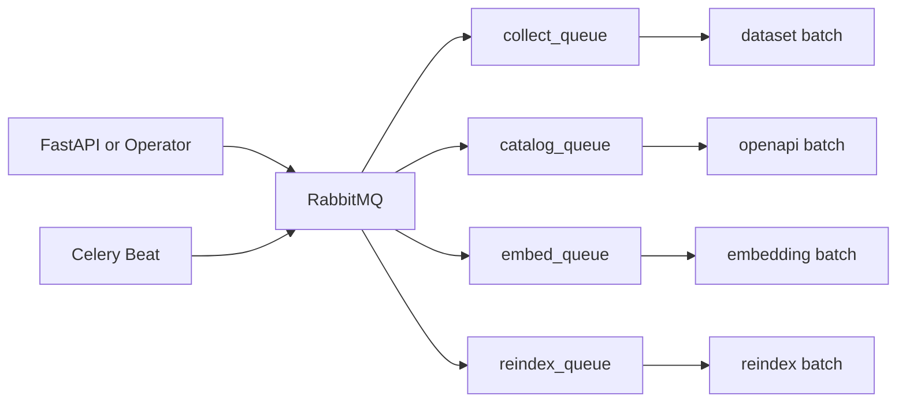

# SODA 데이터 플랫폼 Celery 배치 전환 제안서

## 1. 제안 배경

현재 `data-platform`의 Python 수집 코드는 이미 상당 부분 작성돼 있다.

하지만 운영 관점에서는 아직 아래 문제가 남아 있다.

- 수동 실행 경로와 배치 실행 경로가 분리돼 있다.
- Celery worker/beat는 존재하지만 실제 배치 스케줄은 없다.
- dataset과 openapi 수집기의 성격이 다르지만 운영 정책이 구분돼 있지 않다.
- 수집 상태를 운영 관점에서 추적하는 방식이 약하다.

즉 지금은 **“수집 코드가 있는 상태”**이지,  
**“운영 가능한 배치 시스템이 완성된 상태”**는 아니다.

## 2. 제안 목적

이번 제안의 목적은 다음과 같다.

- Python 수집 코드를 **운영 가능한 배치 시스템**으로 전환한다.
- 데이터셋 수집을 우선 배치화한다.
- openapi 수집은 성격에 맞게 `실수집`과 `카탈로그 refresh`로 나눈다.
- 추후 embedding / reindex까지 연결 가능한 실행 평면을 만든다.

## 3. 제안 요약

### 핵심 제안

- Celery를 수동 실행과 정기 실행의 **공통 실행 엔진**으로 사용한다.
- dataset 수집을 1차 배치 대상로 삼는다.
- dataset는 **전 source를 자동수집 대상**으로 포함한다.
- openapi는 `datagokr`만 1차 정기 배치 대상으로 삼는다.
- FastAPI 수집 API는 thread 기반이 아니라 Celery enqueue 방식으로 바꾼다.
- queue를 `collect` / `catalog` / `embed` / `reindex`로 나눈다.
- RabbitMQ는 현재처럼 **dev/prod를 분리 유지**한다.

### 제안 이유

- 이미 worker/beat/broker 인프라가 있다.
- dataset 수집기는 checkpoint와 run lifecycle이 있어 배치화에 적합하다.
- openapi 수집기는 대부분 문서/정적 카탈로그 성격이라 운영 정책 분리가 필요하다.

## 4. 왜 지금 필요한가

### 4.1 운영 관점

- 현재는 정기 갱신이 없어서 메타데이터 freshness를 보장하기 어렵다.
- 실패 시 source 단위 재실행 전략이 문서화되어 있지 않다.
- 수집 이력과 작업 실행 흐름이 분산돼 있다.

### 4.2 개발 관점

- API 경로와 배치 경로가 다르면 디버깅이 어렵다.
- 동일 작업을 두 실행 모델로 유지하면 코드와 운영 절차가 계속 분기된다.

### 4.3 확장 관점

- 추후 embedding / reindex / 추천 전처리 등 후속 batch를 붙이려면 공통 orchestration이 필요하다.

## 5. 제안 범위

### 포함

- FastAPI 수집 API -> Celery dispatch 전환
- Celery queue 분리
- dataset 정기 배치
- `datagokr` openapi 정기 배치
- run status 추적 구조
- 실패 재실행 기준 수립

### 제외

- 모든 openapi 수집기의 실시간/정기 크롤링화
- embedding / reindex 실제 구현 완료
- source별 상세 DOM 안정화 작업
- 카탈로그성 openapi 수집기의 전면 개편

## 6. 대상 우선순위

### 1차 배치 대상

dataset:
- `data.europa`
- `figshare`
- `zenodo`
- `harvard_dataverse`
- `data_gov`
- `aws_odr`
- `huggingface`
- `kaggle`
- `aihub`
- `public_data_portal`

openapi:
- `datagokr`

### 고위험 자동수집 소스

- `kaggle`
- `aihub`
- `public_data_portal`

사유:
- 인증 의존
- HTML/DOM 구조 리스크
- 외부 정책/차단 가능성

운영 방침:
- 자동수집에는 포함한다.
- 대신 주기는 동일하게 4시간 간격을 유지하되, **source별 offset**을 둔다.
- 연속 실패 시 경고 및 quarantine 후보로 분류한다.

### 카탈로그 refresh 대상

- `crypto_exchange`
- `game`
- `kakao`
- `kis`
- `kobis`
- `naver_map`
- `odsay`
- `tmap`
- `tosspayments`

## 7. 제안 구조

핵심은 간단하다.

- dataset는 `collect_queue`
- openapi catalog는 `catalog_queue`
- embedding / reindex는 후속 queue

현재 1차 구현 반영:

- dataset 수동 실행 API는 Celery enqueue 경로로 전환했다
- beat는 dataset source별 schedule을 개별 entry로 생성한다
- RabbitMQ dev/prod 분리는 기존 host + vhost 구조를 그대로 유지한다

## 8. 기대 효과

### 운영 안정성

- 수동 실행과 배치 실행의 실행 모델이 통일된다.
- 실패 source만 다시 돌릴 수 있다.
- queue backlog와 run 상태를 기준으로 운영 판단이 쉬워진다.

### 개발 생산성

- 수집 로직과 orchestration의 책임이 분리된다.
- 디버깅 포인트가 명확해진다.
- 새 source 추가 시 기존 실행 모델에 자연스럽게 편입된다.

### 확장성

- 향후 embedding / reindex / 후처리 파이프라인을 같은 프레임 안에 넣기 쉽다.

## 9. 리스크와 대응

| 리스크 | 내용 | 대응 |
| --- | --- | --- |
| DOM 변경 | `aihub`, `public_data_portal` 깨질 수 있음 | safe mode, 연속 실패 경고, quarantine 후보 처리 |
| 인증 | `kaggle`, 일부 API key 의존 | 운영 secret 관리 기준 확정, 인증 실패 즉시 실패 |
| 데이터 성격 혼재 | openapi 대부분은 실크롤링이 아님 | 카탈로그 refresh 정책으로 분리 |
| 관찰성 부족 | 실패 원인 추적이 약할 수 있음 | task status, source별 metrics, Mattermost 알림 추가 |
| 외부 quota 집중 | 4시간마다 동시에 돌리면 한도/계정 문제가 생길 수 있음 | source별 offset, overlap 방지, bounded incremental batch |

## 10. 4시간 간격 운영 기준

1차는 **모든 dataset source를 4시간 간격**으로 실행한다.

다만 운영 방식은 `full harvest`가 아니라 **bounded incremental batch**를 기본으로 한다.

의미:
- 4시간마다 source를 깨운다.
- 하지만 매번 무제한 전체 수집을 강제하지 않는다.
- safe mode + per-run limit + checkpoint/resume을 기본 전제로 둔다.

이 방식을 쓰는 이유:
- 외부 API/account limit를 덜 건드린다.
- 장애 복구가 더 쉽다.
- 월요일 마감 전까지 운영 안정성을 확보하기 쉽다.

추가 원칙:
- source별 시작 시각은 offset으로 분산
- 동일 source overlap 금지
- beat 기본값은 `safe=true` + bounded limit(`DATASET_AUTO_COLLECTION_LIMIT`, 기본 20)로 둔다
- 공개 rate limit가 있는 소스는 그 수치보다 훨씬 보수적으로 호출
- 공개 수치가 없는 소스는 `opaque external limit`로 취급

## 11. 단계별 추진안

### 단계 1. 실행 경로 일원화

- FastAPI API -> Celery enqueue
- thread 기반 `collector_service` 축소 또는 제거

### 단계 2. 1차 batch 도입

- dataset 전 source 등록
- `datagokr` 등록
- 4시간 간격 beat schedule + source별 offset 적용
- bounded incremental batch 정책 반영

### 단계 3. 운영 가시성 확보

- run status 조회
- queue backlog 확인
- 실패 알림

### 단계 4. 후속 확장

- embedding
- reindex
- openapi 카탈로그 refresh 정책 고도화

## 12. 팀 의사결정 요청 사항

이번 제안서에서 합의가 필요한 항목은 아래와 같다.

1. dataset를 Celery batch 1차 우선순위로 채택할지
2. dataset 전 source를 자동수집에 포함하되, 고위험 소스는 별도 운영 정책을 적용할지
3. openapi는 `datagokr`만 정기 배치로 보고, 나머지는 카탈로그 refresh로 분류할지
4. FastAPI 수집 API를 Celery dispatch 방식으로 전환할지
5. `all` source 일괄 실행을 운영 기본값에서 제외할지

## 13. 결론

현재 상태는 “Python 수집 코드가 존재하는 상태”이고,  
이번 제안의 목표는 이를 “운영 가능한 배치 시스템”으로 끌어올리는 것이다.

가장 현실적인 방향은 다음과 같다.

- **dataset 우선**
- **dataset 전 source 자동수집 포함**
- **`datagokr` openapi 우선**
- **FastAPI -> Celery 일원화**
- **4시간 간격 + source별 offset + bounded incremental batch**
- **카탈로그성 openapi는 정기 크롤링이 아니라 refresh 정책으로 운영**

이 방향이 현재 코드와 인프라를 가장 덜 깨면서도,
실제 운영 가치가 가장 빨리 나오는 선택이다.
