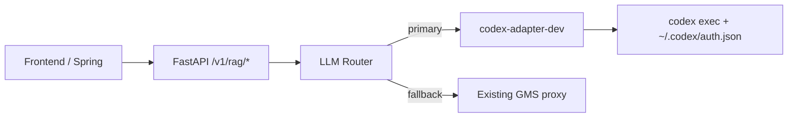

# Codex Dev LLM Router Design

## Goal

`develop` 환경에서만 공용 `auth.json` 기반 Codex 세션을 현재 GMS LLM 경로 앞단에 붙이고, 실패 시 기존 GMS 호출로 자동 fallback 하도록 설계한다. 외부 사용자 계약은 유지하고, 임베딩 경로와 nginx/Jenkinsfile 변경은 dev 1차 범위에서 제외한다.

## Scope

### In Scope

- `data-platform` FastAPI 내부의 GMS 기반 LLM 호출 경로
- dev 전용 `codex-adapter` 서비스 추가
- 공용 `auth.json` 세션을 쓰는 Codex CLI 비대화형 호출
- FastAPI 내부 provider routing, timeout, fallback, 상태 조회
- dev 배포용 optional env 추가

### Out of Scope

- 임베딩 모델 및 배치 임베딩 파이프라인
- frontend / Spring Boot 요청 스펙 변경
- dev 1차에서의 nginx 변경
- dev 1차에서의 Jenkinsfile 변경
- prod 적용

## Directly Verified Constraints

### CI/CD and Infra

- dev Jenkins job은 SCM Jenkinsfile이 아니라 Jenkins 내부에 저장된 inline pipeline이다.
- dev pipeline은 `develop` webhook만 받는다.
- dev pipeline은 `frontend`, `backend`, `data-platform`만 배포하고 `nginx`는 건드리지 않는다.
- `.env.dev`는 Git 파일이 아니라 Jenkins file credential `env-dev`에서 받아 S1의 `.env.dev`로 복사된다.
- 배포 전 env 검증은 `require-env-keys.sh`로 이뤄지며, 여기에 등록된 키가 비어 있으면 배포가 실패한다.
- dev health check는 `fastapi-dev` 컨테이너와 `/v1/health` 기반 `/dev/rag/health`만 본다.

### Current LLM Call Sites

- 채팅 의도 분류와 일반 채팅 답변은 `chat_intent_service.py`에서 GMS OpenAI proxy를 직접 호출한다.
- OpenAPI 추천용 LLM 호출은 `rag_service.py`에 있다.
- merge 추천 이유 생성은 `merge_recommendation_service.py`에서 GMS OpenAI proxy를 직접 호출한다.
- 데이터셋 추천 랭킹 LLM 호출은 `dataset_recommendation_service.py`에서 GMS OpenAI proxy를 직접 호출한다.
- OpenAPI query embedding과 dataset embedding은 별도 경로이며, 이번 범위에서 제외한다.

### Concurrency Risk

- Spring의 채팅 비동기 executor는 `core=4`, `max=8`, `queue=100`이다.
- 한 사용자 요청이 의도 분류, 채팅 답변, 데이터셋 추천, OpenAPI 추천, merge 호출로 갈라질 수 있다.
- 공용 단일 `auth.json` 세션을 무제한 병렬로 두면 세션 흔들림이 전체 채팅 흐름으로 번질 수 있다.

### Codex Runtime Facts

- 로컬 `codex` CLI는 현재 `codex-cli 0.116.0-alpha.10`이다.
- `codex exec`는 비대화형 호출을 지원한다.
- 로컬 Codex 인증 파일은 `~/.codex/auth.json`에 존재한다.
- npm registry 기준 `@openai/codex` 패키지가 존재하고, 설명에 `npm i -g @openai/codex`가 포함되어 있다.

## Design Principles

- dev 1차는 운영 blast radius 최소화가 우선이다.
- 공용 Codex 세션은 adapter가 보호하고, FastAPI는 adapter 실패 시 즉시 GMS로 복구한다.
- dev에서 바뀌는 건 FastAPI, dev compose, dev env, 수동 배치된 Codex home 디렉터리까지만 허용한다.
- 배포 성공 조건은 기존과 동일하게 FastAPI health 기준으로 유지한다.

## Architecture

### 1. Dev-only Codex Adapter

별도 Python FastAPI 서비스 `codex-adapter-dev`를 추가한다. 이 서비스는 내부적으로 `codex exec`를 subprocess로 실행하고, 공용 세션이 깨지지 않도록 요청 직렬화와 bounded queue를 담당한다.

dev 1차에서는 container 안 `/root/.codex` 디렉터리를 host path와 volume mount 한다. 운영자가 S1에 수동으로 다음 경로를 준비한다.

- `/home/ubuntu/soda-dev/secrets/codex-home/auth.json`

이 방식은 `auth.json` 파일 단독 mount보다 안전하다. host 디렉터리가 없어도 compose 자체는 깨지지 않고, adapter는 인증 미존재 상태를 자기 상태값으로 노출한 뒤 FastAPI가 fallback 하도록 만들 수 있다.

### 2. FastAPI LLM Router

FastAPI 내부에 공통 LLM routing 계층을 추가한다. 이 계층은 “Codex adapter 우선, 실패 시 GMS fallback” 정책을 숨긴다.

대상 호출은 다음 네 종류다.

- recommendation mode classification
- plain chat answer
- dataset ranking LLM
- OpenAPI summary / merge reason LLM

임베딩 호출은 routing 대상이 아니다.

### 3. Local-only Status Endpoint

FastAPI에 `GET /v1/internal/llm/status`를 추가한다. dev 1차에서는 nginx에 노출하지 않는다. 확인은 S1에서 로컬 포트로만 수행한다.

예시 확인 경로:

- `curl http://127.0.0.1:18086/v1/internal/llm/status`

응답은 최소한 다음을 포함한다.

- `primaryProvider`
- `codex.enabled`
- `codex.reachable`
- `codex.authPresent`
- `codex.lastSuccessAt`
- `codex.lastFailureAt`
- `codex.lastFallbackReason`
- `codex.queueDepth`

## File Layout

### New Files

- `data-platform/codex_adapter/Dockerfile.dev`
- `data-platform/codex_adapter/app/__init__.py`
- `data-platform/codex_adapter/app/main.py`
- `data-platform/codex_adapter/app/config.py`
- `data-platform/codex_adapter/app/schemas.py`
- `data-platform/codex_adapter/app/runner.py`
- `data-platform/codex_adapter/app/status.py`
- `data-platform/api/app/services/llm_router.py`
- `data-platform/api/app/services/gms_chat_client.py`
- `data-platform/api/tests/test_llm_status_endpoint.py`
- `data-platform/api/tests/test_llm_router.py`
- `data-platform/codex_adapter/tests/test_runner.py`

### Modified Files

- `data-platform/docker-compose.dev.yml`
- `data-platform/api/app/core/config.py`
- `data-platform/api/app/api/v1/router.py`
- `data-platform/api/app/api/v1/endpoints/rag.py`
- `data-platform/api/app/services/chat_intent_service.py`
- `data-platform/api/app/services/rag_service.py`
- `data-platform/api/app/services/merge_recommendation_service.py`
- `data-platform/api/app/services/dataset_recommendation_service.py`
- `data-platform/api/app/services/openapi_recommendation_service.py`

## Request Flow

### Chat Intent / Chat Answer

1. Spring은 기존처럼 FastAPI `/infer-recommendation-mode`, `/chat-answer`를 호출한다.
2. FastAPI endpoint는 기존 request / response schema를 유지한다.
3. `ChatIntentService`는 직접 GMS를 치지 않고 `LlmRouter`를 사용한다.
4. `LlmRouter`는 adapter에 공통 chat-completion request를 보낸다.
5. adapter 성공 시 Codex 결과와 모델명을 반환한다.
6. adapter 실패 시 `GmsChatClient`로 동일 payload를 재시도한다.

### Dataset Ranking LLM

1. 벡터 검색 및 candidate 수집은 기존 로직 유지
2. ranking prompt만 `LlmRouter`를 타도록 분리
3. query embedding은 기존 `DATASET_EMBEDDING_API_KEY` 경로 유지

### OpenAPI Recommendation

1. query embedding은 기존 Gemini/GMS 경로 유지
2. LLM summary 생성만 `LlmRouter`를 타도록 변경
3. `OpenApiRecommendationService`는 `rag_service.query()` 결과 model 값을 그대로 기록

### Merge Recommendation

1. merge 이유 생성만 `LlmRouter` 경유
2. 실패 시 GMS fallback 결과를 그대로 저장

## Concurrency and Safety Rules

### Adapter

- adapter 내부 동시 실행 수는 dev 1차에서 `1`
- queue는 bounded로 유지
- queue 초과 시 adapter는 즉시 `503` 또는 명시적 overload 오류 반환
- overload, timeout, auth missing, subprocess non-zero exit, malformed JSON은 FastAPI fallback 조건이다

### FastAPI Router

- adapter는 최대 1회만 시도
- fallback GMS는 최대 1회만 시도
- 최종 실패 시 현재와 동일한 `502` 계열 오류를 유지
- fallback이 발생한 사실은 status 집계에 남긴다

## Configuration

### New Optional env keys in `env-dev`

- `LLM_PRIMARY_PROVIDER=codex`
- `CODEX_ADAPTER_ENABLED=true`
- `CODEX_ADAPTER_BASE_URL=http://codex-adapter-dev:8091`
- `CODEX_FALLBACK_TO_GMS=true`
- `CODEX_MODEL=gpt-5.4`
- `CODEX_TIMEOUT_SECONDS=45`
- `CODEX_MAX_CONCURRENCY=1`
- `CODEX_MAX_QUEUE=100`
- `CODEX_HOME_HOST_PATH=/home/ubuntu/codex-home-dev`

### Important env policy

- 위 키들은 dev 1차에서 모두 optional이다.
- `require-env-keys.sh`의 필수 검증 목록에는 추가하지 않는다.
- `CODEX_HOME_HOST_PATH`가 비어 있거나 `auth.json`이 없더라도 FastAPI 전체 기동은 살아 있어야 한다.

## Dev Deployment Model

### What changes in dev 1st rollout

- `develop` 브랜치에 FastAPI / data-platform compose 변경 반영
- Jenkins `env-dev` credential에 optional env 추가
- S1 dev 호스트에 `auth.json` 수동 배치

### What does not change in dev 1st rollout

- `Jenkinsfile.dev`
- `Jenkinsfile.prod`
- `infra/nginx/nginx.conf`
- prod stack

## Failure Handling

### Adapter failure classes

- Codex binary missing
- auth file missing
- login/session expired
- CLI timeout
- CLI exit code non-zero
- response JSON parse failure
- queue overflow

### FastAPI behavior

- 위 실패는 모두 provider fallback 대상으로 본다.
- fallback 성공 시 API 응답은 `200` 유지
- 최종 model 이름은 실제 사용 provider 기준으로 기록한다.
- fallback 실패 시 기존과 동일한 upstream error 형식 유지

## Observability

dev 1차는 외부 모니터링 경로를 추가하지 않는다. 대신 다음 두 계층만 둔다.

- adapter 내부 메모리 상태값
- FastAPI local-only status endpoint

필요 시 추후 prod 단계에서만 nginx `/internal/...` 경로를 추가한다.

## Risks and Mitigations

### Shared session instability

- 완화: adapter 직렬화, bounded queue, 즉시 fallback

### Adapter not covered by Jenkins health

- 완화: health gate는 유지하되 local status endpoint와 실제 chat smoke를 dev 검증 체크리스트에 포함

### Manual secret drift on S1 dev

- 완화: host path를 고정하고 status endpoint에 `authPresent` 노출

### CLI installation drift

- 완화: adapter Dockerfile에서 Codex CLI 버전을 명시 고정

## Acceptance Criteria

- dev 배포가 기존 Jenkins dev pipeline으로 성공한다.
- `fastapi-dev` health와 `/dev/rag/health`가 정상이다.
- `auth.json`이 있을 때 최소 한 건의 채팅 요청이 Codex primary로 처리된다.
- adapter를 강제로 죽이거나 auth를 제거해도 동일 요청이 GMS fallback으로 성공한다.
- 임베딩 동작은 변경되지 않는다.
- frontend / Spring request schema는 변경되지 않는다.
